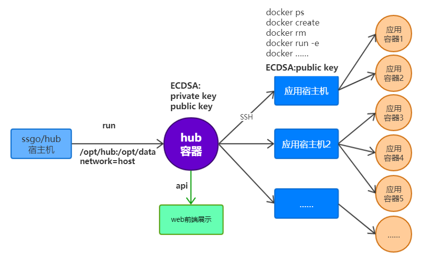

# 快速使用

首先宿主机上要安装docker

```shell
docker run -d --network=host --restart=always -v /opt/hub:/opt/data ssgo/hub
```

镜像也可以自己根据ssgo/hub的代码进行构建

## 容器网络模式

容器启动需要使用主机网络模式，使用宿主机网络和端口，通讯效率高

## 存储依赖

数据会存储在 /opt/data 下，可以使用 -v /opt/hub:/opt/data 来挂载外部磁盘

# 自定义镜像

编译hub：

```
cd hub根目录
sed -i 's/__TAG__/$TAG/g' www/index.html
go mod tidy
go build -ldflags -w -o dist/server *.go
cp *.json dist/
cp -ra www dist/
```

Dockerfile：

```
FROM alpine
ADD zoneinfo/PRC /etc/localtime
RUN sed -i 's/dl-cdn.alpinelinux.org/mirrors.aliyun.com/' /etc/apk/repositories && apk add openssh-client && rm -f /var/cache/apk/*
ADD dist/ /opt/
ENTRYPOINT /opt/server
HEALTHCHECK --interval=10s --timeout=3s CMD /opt/server check
```

构建镜像：
```shell
docker build . -t $REGISTRY$CONTEXT/$PROJECT:$TAG
docker push $REGISTRY$CONTEXT/$PROJECT:$TAG
```

# 容器与配置管理中心

## 基本配置

可在项目根目录放置一个 hub.json

```json
{
  "CheckInterval": 5,
  "dataPath": "",
  "manageToken": "91hub"
}
```

checkInterval   检查应用状态的间隔时间，单位为秒，不填写默认为5

dataPath        代表hub的配置持久化存储的路径，不填写默认为/opt/data

manageToken     代表hub的登录密码，以读写方式查看节点和应用的运行状态

可以使用 -e 'dock_xxxxxx=xxxx' 进行配置


启动容器：

使用 -e hub_managerToken=91hub 配置查看和管理口令进行登录授权

使用 -e service_xxxx 来配置 http 相关参数，例如可以配置为基于 https 访问，具体配置请参考 https://github.com/ssgo/s

## 访问

hub访问通过：http://xx.xx.xx.xx:8888/

默认使用 8888 端口，可以使用 -p xxxx:8888 来改变端口

# docker

hub本身由docker启动，可以使用容器内的hub来做远程目标机器的容器编排管理。

## Node Installer

hub管理中心通过ssh连接到docker应用容器部署的宿主机，需要使用公钥无密登录到远程宿主机

在hub的Docker > global 菜单下，复制Node Installer下命令到目标宿主机，执行命令

```shell
    curl http://hubHost:8888/install/eqWTGOckcbi | sh
```

目标机安装了公钥以后，hub容器就可以操作目标机中的容器。

## docker管理底层原理



* hub宿主机docker run开启hub容器
* hub界面触发docker操作，由前端向hub api触发请求
* hub容器通过公钥无密登录到目标宿主机执行对应的docker命令
* 目标宿主机返回执行结果到hub容器
* hub容器得到结果返回给界面展示

## global

### Nodes

设置目标机器的地址,也就是节点，同时设置节点的cup总核数，和总内存(单位为：G)

可以自动获取到使用的cup核数与内存数，节点在跑的实例数

注意：设置节点ip地址前，一定要按照**Node Installer**的命令在节点上安装公钥，不然hub无法访问到节点机器

### Global Vars

启动容器的全局变量，可以应用于多个项目中

在容器实际编排的时候，${Key}可以将Value的值加到docker run命令中

例如：

```
-p 8001:80 ${redis_conn} -e 'SNAME=abc'
```

### Global Args

每一个项目的启动容器容器的命令都要自动加上Global Args设置的值

比如说，我们推荐使用host网络模式启动容器：

```
--network=host
```

这样hub上再跑的所有项目的容器都采用了host网络模式

## 自定义context

将项目归类划分建立的二级菜单，由用户自定义，可以添加和删除

单个Context中：

### Apps

实际编排的设置，在这里指定：

* Image 镜像
* Cpu
* Mem 内存
* Min 容器实例跑的最小数量
* Max 容器实例在跑的最大数量
* Args 启动容器指定的docker run参数
* Command   作为args的补充命令使用
* Memo 容器的备注
* √  是否启动容器

Args参数后面有一个小铅笔编辑按钮，让docker run的参数更改和查看的时候更加直观，推荐使用

Min Hub会按照Min的数量分配到容器绑定的节点上,优先考虑平均分布。挂载磁盘的，尽可能的分布到不同节点

Max：当容器在跑的数量超过max的时，会自动杀掉多的部分保持在跑的实例容器数量最大值为Max

**节点分配权重算法**

每个项目App绑定了多台机器Node节点，节点在global的Nodes中设置，在当前context > Binds指定,根据score算法取得最小值的节点进行容器部署。

每个节点score初始值：

```
score := node.UsedMemory/node.Memory + node.UsedCpu/node.Cpu
```

如果节点上已经有当前App的容器应用,并且挂载了宿主机目录，那么：`score = score+100`

如果节点上已经有当前App的容器应用，没有挂载目录那么根据App设置的Min值节点数进行叠加，：

```
if app.Min <= 2 {
    // 2个节点 强平均分配，增加 300% 权重
    score += 3
} else if app.Min <= 4 {
    // 3~4个节点 较强平均分配，增加 150% 权重
    score += 1.5
} else if app.Min <= 6 {
    // 5~6个节点 略强平均分配，增加 80% 权重
    score += 0.8
} else {
    // 7个及以上节点 弱平均分配，增加 30% 权重
    score += 0.3
}
```

节点上没有部署当前App，score不叠加

最终找到score最小的Node，进行容器部署

### Vars

启动容器的局部变量，可以应用于单个context的多个项目中

在容器实际编排的时候，${Key}可以将Value的值加到docker run命令中

### Binds

指定Nodes定义的镜像在哪些节点机器上跑，要和Nodes中指定的镜像名tag号保持一致

### Token

访问hub的api需要提供的token，和安全性相关，不可轻易透露。

### Memo

Context的备注备忘

# Gateway Config

在hub中配置微服务的网关，可以设置proxies和rewrites，代理内部服务指定路由对外提供api

在设置gateway路由配置前，需要先配置网关对应的redis。Docker菜单的global二级菜单下指定Global Vars，key和value分别为：

```
discover   -e 'discover_registry=ip:端口:数据库:aes加密后的密码'
```